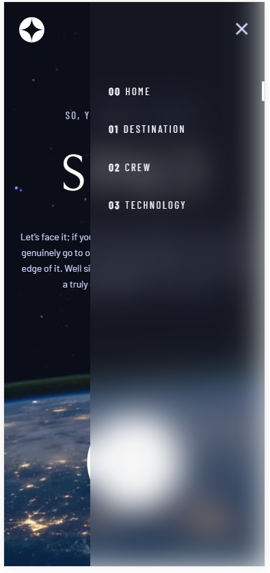

# Space Tourism Website

> A multi-page website designed to showcase space tourism opportunities, built as a Frontend Mentor challenge.
> Live demo [_here_](https://lukass9.github.io/space-tourism/).

## Table of Contents

- [General Info](#general-information)
- [Technologies Used](#technologies-used)
- [Features](#features)
- [Screenshots](#screenshots)
- [Setup and Usage](#setup-and-usage)
- [Contact](#contact)

## General Information

The Space Tourism Website project aims to provide an immersive experience into space tourism, catering to enthusiasts interested in future recreational space travel.

### Purpose

Addressing the curiosity surrounding space tourism, the project offers comprehensive insights into potential travel opportunities, aiming to bridge the gap in accessible information and highlight feasibility.

### Objectives

Replicating a realistic space tourism website design from Frontend Mentor, the project enhances coding skills in HTML, CSS, and JavaScript. It serves as a portfolio piece showcasing frontend development expertise, including the utilization and mastery of React Router for seamless page navigation.

## Technologies Used

- React - v18.2.0
- React Router DOM - v6.3.0
- Styled-components - v5.3.5

## Features

- Responsive design for optimal viewing on various devices
- Hover states for interactive elements
- Page toggling functionality between tabs for new information

## Screenshots

## Setup and Usage

- Clone the repository
- Install dependencies with `npm install` or `yarn install`
- Run the application locally with `npm start start` or `yarn start start`
- Visit [localhost](http://localhost:3000) in your browser to view the application

## Contact

Created by [@Lukass9](https://github.com/Lukass9) - feel free to contact me!
